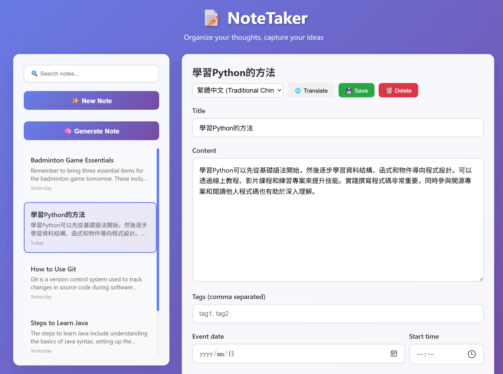
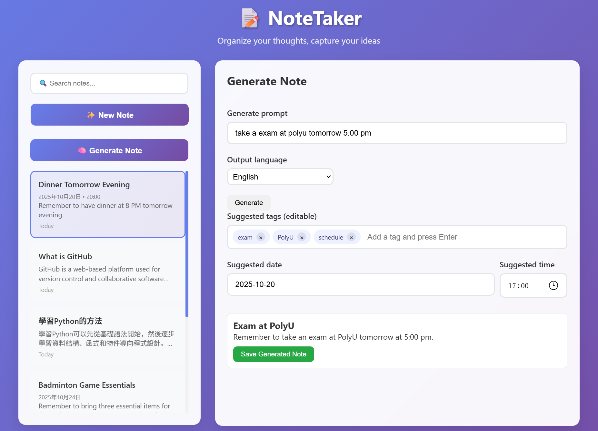

# lab2_writeup

## Improve the notes taking app

### 1. Add Feature: Translate Notes

**Steps:**

1. Get an API Key

2. Store the API key in .env file and add .env in .gitignore file

3. Add src/llm.py file and translate_note function

 4. Add the library in requirements.txt

    ```
    openai==1.106.1
    dotenv==0.9.9
    ```

    Install the library in the virtual environment

 5. Test translate_note function

 6. Use the copilots “Agent mode” to add function "translate notes"

    ```
    Based on the '/notes/translate' interface in note.py, add elements such as a translation button and a target language selection box on the front end to implement the sending of translation requests and the display of results, and associate it with the save and delete functions.
    ```

### 2. Add Feature: Generate Notes

**Steps:**

1. Add process_user_notes function in src/llm.py file 

2. Test translate_note function

3. Use the copilots “Agent mode” to add function "Generate notes"

   ```
   In the `src/routes/note.py` file, add a note generation interface. On the front end, add a natural language input box, an output language selection box, and a generation button. Call the API to display a preview of the generated note and support a save function.
   ```
   
   

4. Use the copilots “Agent mode” to extend the “Generate notes” function to  extract the date and time

   ```
   Based on the process_user_notes function in llm.py, extend the generate note function of the note app. When there is content related to date and time in the prompt, set the date and time for the generated note, and extract tags based on the content.
   ```

   

## Deploy the notes taking app

### 1. Use Postgres in Supabase (Cloud database)

Steps：

1. Register a Supabase account, create a project, and obtain the database connection information (URL, username, password)

2. Create "note" table in supabase project

3. Use the copilots “Agent mode” to change the db

   ```
   Change the SQLite-related configuration to the Postgres configuration.
   ```


4. Test

### 2. Deploy the app in Vercel

Steps:

1. Register a vercel account, add new project, import Git Repository
2. Add environment variables (GITHUB_TOKEN, DATABASE_URL, SUPABASE_URL, SUPABASE_KEY)\
3. Deployment

